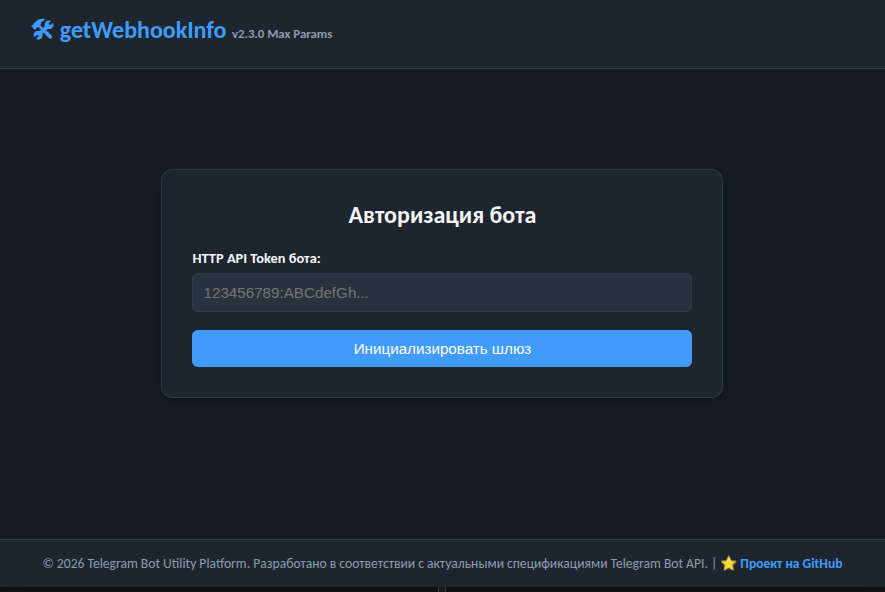
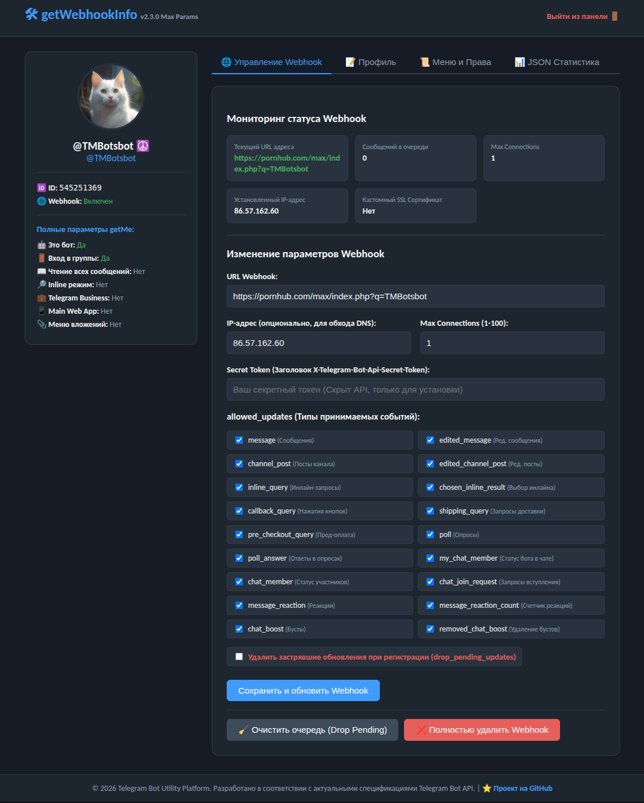
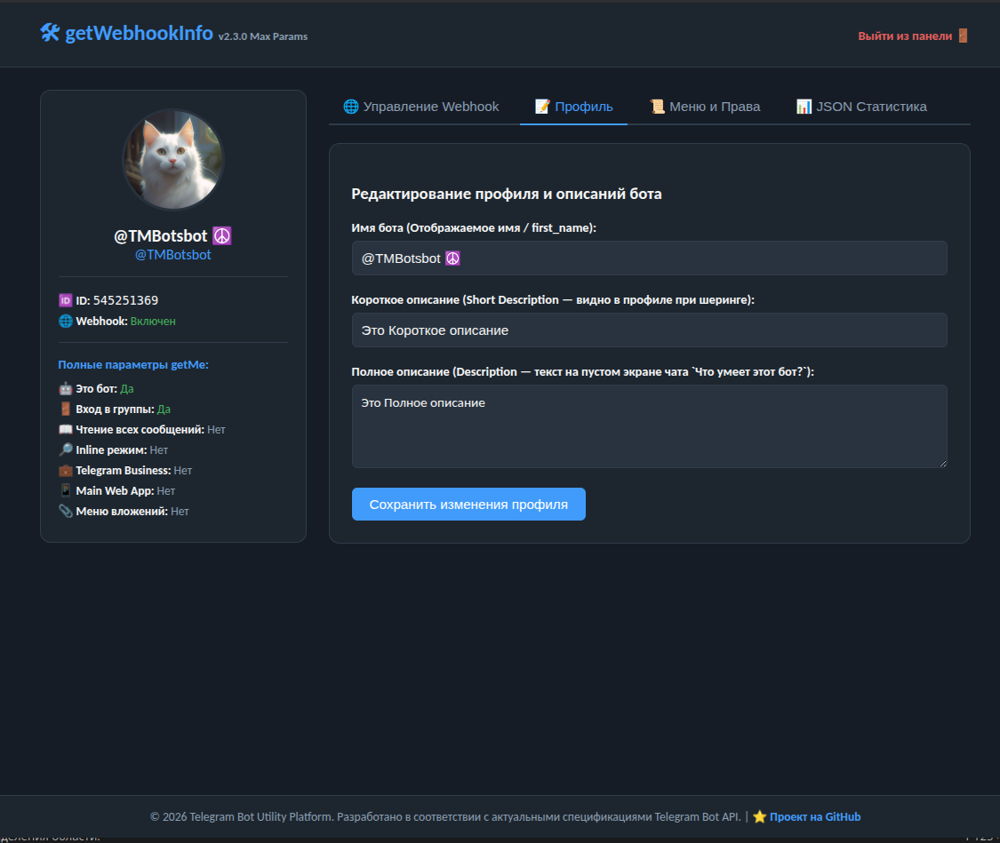
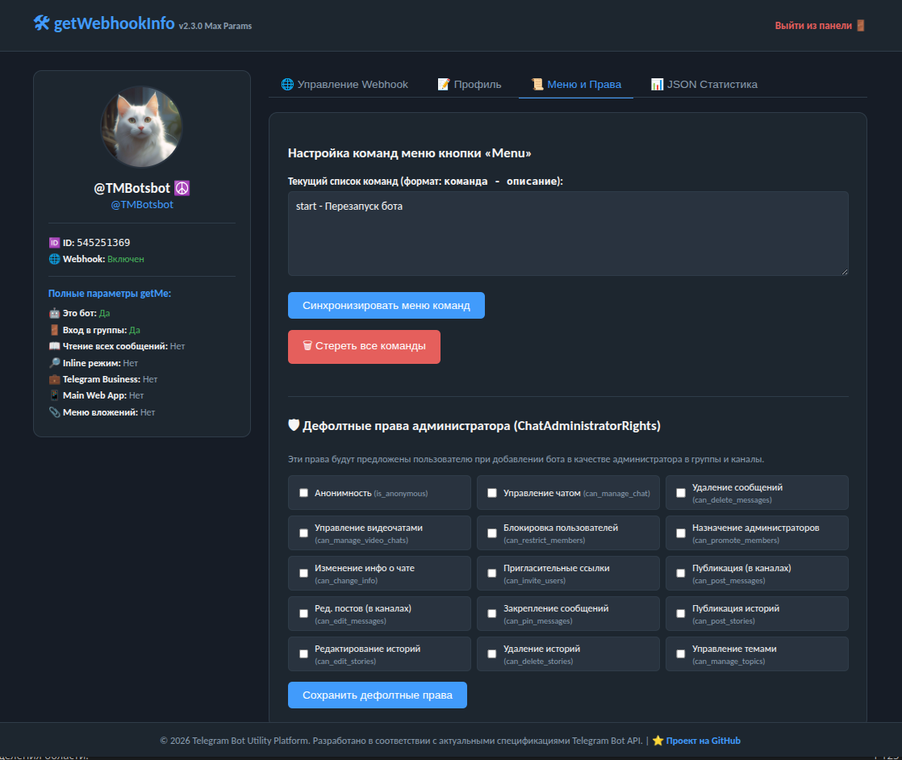

# Advanced Telegram Bot Configuration Manager

Инструмент для глубокого администрирования Telegram-ботов прямо из браузера. Управляйте Webhook, профилем и правами администратора без написания кода.

## 🚀 Основные возможности
- **Управление Webhook:** Полная настройка URL, `max_connections`, `allowed_updates` и `secret_token`.
- **Профиль бота:** Редактирование имени, короткого описания и полного описания (Description) за один клик.
- **Меню команд:** Синхронизация меню `Menu` в Telegram через удобный текстовый интерфейс.
- **Права администратора:** Гибкая настройка прав по умолчанию для групп и каналов.
- **Темная тема:** Стильный UI, адаптированный под Telegram-эстетику.

## 📸 Интерфейс

| Авторизация | Управление Webhook | Профиль бота | Команды и Права |
| :---: | :---: | :---: | :---: |
|  |  |  |  |

## 🛠 Установка
1. Скопируйте файл `index.php` на ваш хостинг.
2. Убедитесь, что у вашего сервера есть доступ к `api.telegram.org`.
3. Просто откройте файл в браузере и введите токен вашего бота.

## 📋 Инструкция по работе
1. **Авторизация:** Введите HTTP API токен, полученный от @BotFather.
2. **Вкладка Webhook:** Установка, проверка или удаление вебхука. Мониторинг ошибок в реальном времени.
3. **Вкладка Профиль:** Обновление публичной информации (Имя, Описания), видимой пользователям.
4. **Вкладка Меню и Права:** Настройка команд в формате `команда - описание` и установка дефолтных прав администратора.

---
*Разработано для быстрого администрирования ботов. Поддерживает актуальные методы Bot API 2026 года.*
